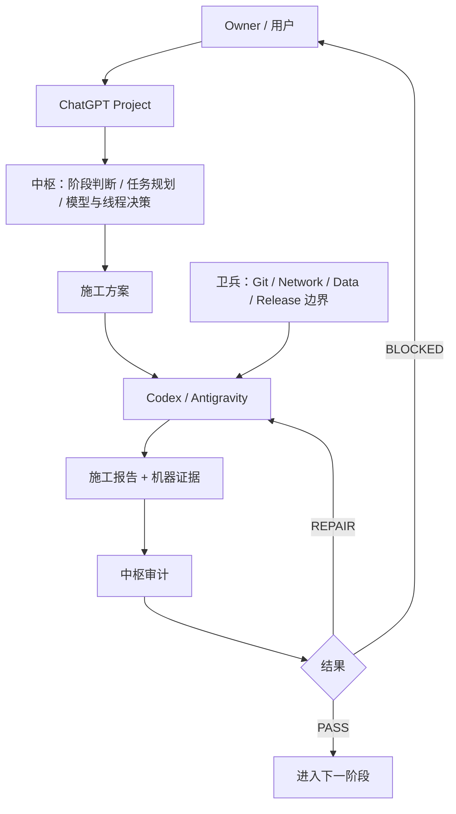

# 中枢 (Zhongshu) Runtime

**中枢让 ChatGPT 更可靠地统筹 Codex / AI Agent 的长期软件开发。**

中枢不是一个普通代码生成器。中枢解决的是 AI 长周期开发中的统筹、收口、边界和连续性问题。

## 1. 为什么需要中枢

在长期的 AI 辅助开发中，你是否遇到过以下痛点：
- **没有中枢时**：每次开新对话都要重新解释项目上下文，模型经常忘记之前的约定。
- **没有中枢时**：Agent 说“完成了”，但你不知道是否遗漏了测试或边界情况。
- **没有中枢时**：项目推进中经常不知道下一步最小动作，小问题反复停下来等人工确认。
- **没有中枢时**：线程越来越长，模型成本极高且上下文污染越来越重。

**使用中枢后：**
- **减少重复解释**：为长线程提供压缩交接与换线程判断。
- **严格收口**：审计施工报告与机器证据，而不是只听口头汇报。
- **明确路径**：输出“最小下一步”，降低反复规划成本。
- **边界控制**：在不过度治理的前提下控制 Git、Network、Data 和 Release 的风险边界。
- **稳定协作**：帮助你在 ChatGPT、Codex / Antigravity 与卫兵之间建立稳定协作。

## 2. 它是如何工作的



## 3. 真实工作流示例

中枢在实际开发中是如何介入的？

**你的输入：**
> “这是当前阶段 Codex 的施工报告，请检查质量并给出最小下一步。”

**中枢会做什么：**
1. 读取报告内容。
2. 核对是否包含 required tests、工作区状态及有效的机器证据。
3. 判断当前阶段是 PASS、REPAIR 还是 BLOCKED。
4. **如果 PASS**：给出下一阶段的最小施工方案。
5. **如果 REPAIR**：指出需要补齐的具体问题，让 Codex 返工。

**你得到了什么：**
你得到的不是泛泛的“继续开发”，而是**更小、更稳、更可执行的下一步**。

## 4. 适用条件

**你需要什么：**
- 一个 ChatGPT Project
- 一个正在开发的软件项目（如果需要调用 Codex/Antigravity）

**你不需要：**
- Git
- Python
- GitHub CLI
- Clone 本仓库
- 先安装卫兵

**关于卫兵（可选增强）：**
最低可用只需 ChatGPT Project + 中枢。若需要本地 Agent 执行代码修改，再接入 Codex / Antigravity。如果需要更严格的施工现场治理和防灾保护，再配合卫兵。新手完全可以先只体验网页版中枢统筹。

## 5. 新手 5 分钟 Quick Start

要将中枢部署到一个新的 ChatGPT Project 中，只需以下 8 步：

1. 从 Release 页面下载 Latest Runtime Pack (ZIP文件)
2. 解压 ZIP 文件
3. 打开解压后的 `project-upload/` 目录
4. 全选并上传 `project-upload/` 中的所有文件到 ChatGPT Project 的 Project Sources
5. 打开解压根目录的 `PROJECT_INSTRUCTIONS.txt`
6. 复制全文到 ChatGPT Project 的 Project Instructions
7. 发送安装自检提示词（见下）
8. 收到 `ZHONGSHU_RUNTIME_READY` 即部署完成

### 安装自检提示词

开启新对话，发送：

```text
检查中枢是否部署完整。

请只检查当前 Project 已提供的中枢 Runtime：

1. 告诉我检测到的 Runtime 版本；
2. 检查需要的 Project Source 文件是否完整；
3. 检查 Project Instructions 是否已生效；
4. 如果缺少文件，直接告诉我缺哪个；
5. 如果完整，只回复：

ZHONGSHU_RUNTIME_READY

并告诉我下一步如何启动一个新项目。
```

## 6. 日常最常用的三句话

部署完成后，这是你最常和中枢说的话：

- **Codex 做完以后：** `按中枢审计这份施工报告。`
- **要下一轮施工：** `生成下一步最小施工方案。`
- **当前线程太长：** `按中枢判断是否应该换线程；如果应该，生成最小充分交接。`

## 7. 完整说明与高级用法

完整部署说明、高级用法、升级方式、中枢与卫兵的详细关系、线程策略、故障排查、各版本新特性等，请参阅：

[README_部署与使用.md](README_部署与使用.md)
