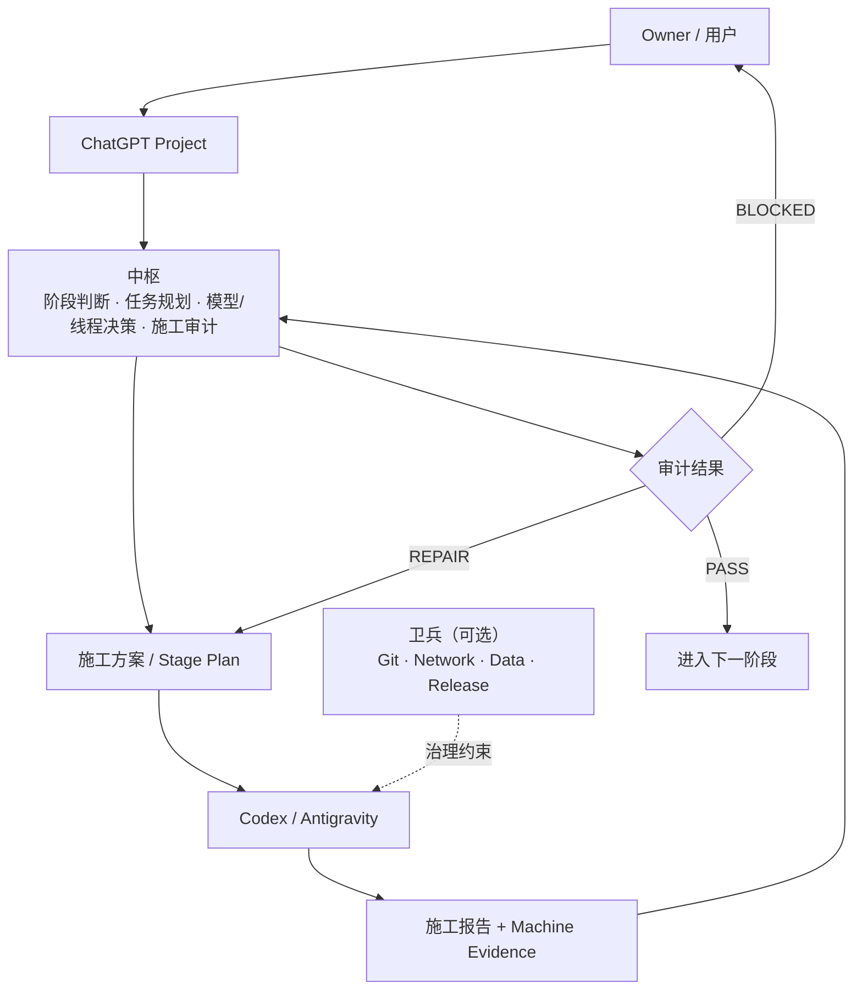

<p align="right">
  <strong>Language:</strong>
  简体中文 · <a href="README_EN.md">English</a>
</p>

<h1 align="center">Zhongshu / 中枢</h1>

<p align="center">
  <strong>让 ChatGPT + Codex 在长期软件项目里保持上下文、验证真实完成，并持续知道下一步该做什么。</strong>
</p>

<p align="center">
  长期 AI 软件开发的项目统筹与审计层
</p>

<p align="center">
  <a href="../../releases/latest"></a>
  <a href="../../actions/workflows/repository-consistency.yml"></a>
  <a href="LICENSE"></a>
</p>

**[5 分钟开始](#5-分钟开始)** · **[Latest Release](../../releases/latest)** · **[完整文档](#更多)**

<p align="center">
  
</p>

## 中枢解决什么？

### `01` 长项目上下文不断线

项目跨阶段、跨线程推进后，中枢持续维护当前状态和交接信息，让新线程能够接着做。

### `02` Agent 的“完成”可以验证

中枢检查施工报告、测试结果和机器证据，判断当前任务是 **PASS / REPAIR / BLOCKED**。

### `03` 每轮都有明确下一步

中枢根据当前真实状态，只给出最值得推进的下一步，而不是每次重新规划整个项目。

## 它怎么工作？

中枢是项目级的编排层：它判断阶段、规划工作、审计施工结果，并将真实风险边界交给可选的卫兵治理层。



### 实际使用很简单

Codex 完成一轮施工后，把报告交给中枢：

> “这是最新施工报告，请检查是否真正完成，并告诉我下一步。”

**报告 → 测试 / 证据 → PASS / REPAIR / BLOCKED → 下一步**

## 5 分钟开始

无需 Git、Python、GitHub CLI，也不需要先安装卫兵。你只需要一个 ChatGPT Project；如需本地代码施工，再接入 Codex / Antigravity。

1. 从 [Latest Release](../../releases/latest) 下载 **Latest Runtime Pack**（ZIP）。
2. 解压 ZIP 文件。
3. 打开解压目录中的 `project-upload/`。
4. 将 `project-upload/` 的全部文件上传到 ChatGPT Project 的 Project Sources。
5. 打开 `PROJECT_INSTRUCTIONS.txt`，将全文复制到 ChatGPT Project 的 Project Instructions。
6. 发送以下安装自检提示词。
7. 收到 `ZHONGSHU_RUNTIME_READY` 即部署完成。

```text
检查中枢是否部署完整。

请只检查当前 Project 已提供的中枢 Runtime：

1. 告诉我检测到的 Runtime 版本；
2. 检查需要的 Project Source 文件是否完整；
3. 检查 Project Instructions 是否已生效；
4. 如果缺少文件，直接告诉我缺哪个；
5. 如果完整，只回复：

ZHONGSHU_RUNTIME_READY

并告诉我下一步如何启动一个新项目。
```

## 适合谁？

| 适合 | 可能不需要 |
|---|---|
| ✓ 持续多轮的软件项目 | ✗ 一次对话即可完成的小脚本 |
| ✓ 多阶段 / 多线程 Agent | ✗ 单文件简单修改 |
| ✓ 需要验证 Agent 是否真的完成 | ✗ 不需要长期上下文 / Agent 审计 |

## 更多

### 更多能力

保持上下文 · 施工审计 · 最小下一步 · 必要风险边界

[查看完整能力说明 →](README_部署与使用.md#12-详细能力矩阵)

### 中枢与卫兵

中枢负责“现在该做什么”；卫兵是可选增强，负责约束 Agent“可以怎么做”。

[查看完整说明 →](README_部署与使用.md#6-与卫兵的关系)

### Documentation

- [5 分钟部署](START_HERE.md)
- [完整部署与使用](README_部署与使用.md)
- [核心 Runtime](SKILL.md)
- [Release Governance](RELEASE_GOVERNANCE.md)
- [CHANGELOG](CHANGELOG.md)

<details>
<summary><strong>边界 / 设计原则摘要</strong></summary>

**当前边界：**
中枢不是 Coding Agent、IDE、自动代码生成器、CI/CD 平台或卫兵的替代品。当前主要服务于 ChatGPT Project + Codex / Antigravity 的长期软件开发统筹。中枢保持可独立使用；卫兵是可选的现场治理增强。

**设计原则：**
- Minimum Sufficient Governance：治理只做到足够。
- Evidence over Claims：收口需要可核对的证据。
- Smallest Next Step：每次只规划当前最值得推进的一步。
- Finish Local Value, Then Compress：长线程先完成当前局部价值再压缩。
- Execution Form Is Not Risk：应根据真实副作用决定边界。
</details>

Licensed under the [MIT License](LICENSE).
