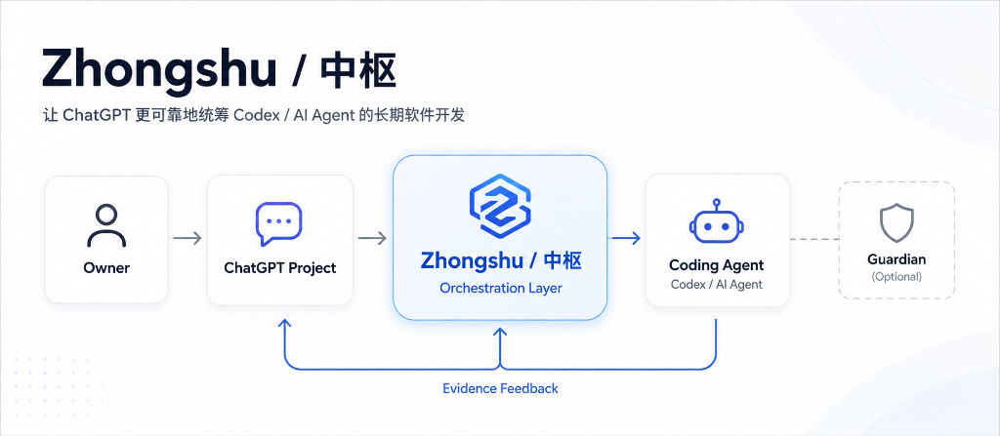
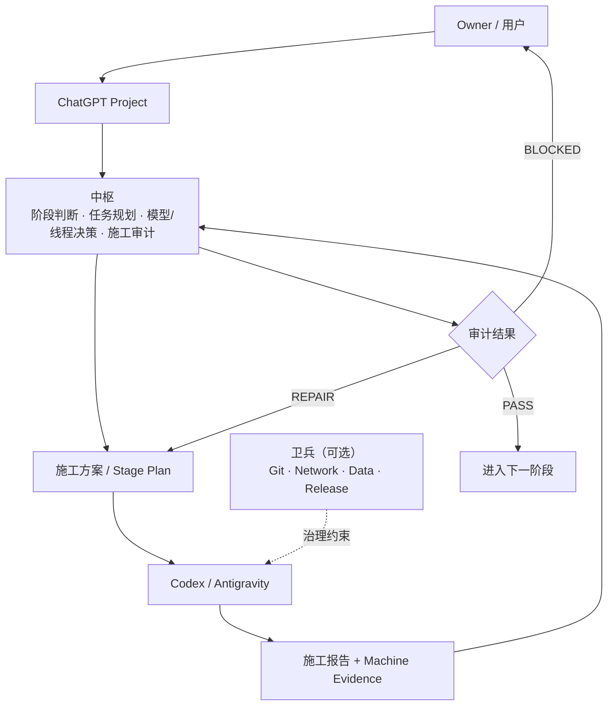

# Zhongshu / 中枢

[](../../releases/latest)
[](../../actions/workflows/repository-consistency.yml)
[](LICENSE)
[](MANIFEST.json)

让 ChatGPT + Codex 在长期软件项目里保持上下文、验证真实完成，并持续知道下一步该做什么。

中枢不是 Coding Agent。
它是长期 AI 软件开发中的项目统筹与审计层。

## 中枢解决什么？

| 核心问题 | 中枢怎么处理 | 用户得到什么 |
|---|---|---|
| 项目做久后上下文断裂 | 维护阶段、状态和交接 | 新线程继续推进 |
| Agent 自报完成 | 检查报告、测试和证据 | PASS / REPAIR / BLOCKED |
| 不知道下一步 | 基于当前状态生成最小下一步 | 不重复规划整个项目 |

中枢遵循“最低充分治理”：只增加真正能降低风险或提高推进质量的治理。

**[5 分钟开始](#5-分钟开始)** · **[Latest Release](../../releases/latest)** · **[完整文档](#更多文档)**

<p align="center">
  
</p>

## 它怎么工作？

中枢是项目级的编排层：它判断阶段、规划工作、审计施工结果，并将真实风险边界交给可选的卫兵治理层。



### 更多统筹价值

| 常见 Agent 开发痛点 | 使用中枢后 |
| --- | --- |
| 小问题频繁等待 Owner | 边界内低风险问题连续闭环 |
| 长线程不断累积噪声 | 在稳定节点压缩并判断是否换线程 |
| 模型选择全靠经验 | 自动推荐最低充分模型与推理强度 |
| 边界模糊 | 依据真实副作用明确 Owner Gate |

## 一个真实使用方式

Codex 完成一轮施工后，你只需要把报告交给中枢：

> “这是最新施工报告，请检查是否真正完成，并告诉我下一步。”

中枢会：

报告 → 测试 / 机器证据 → PASS / REPAIR / BLOCKED → 下一步施工方案

## 5 分钟开始

无需 Git、Python、GitHub CLI，也不需要先安装卫兵。你只需要一个 ChatGPT Project；如需本地代码施工，再接入 Codex / Antigravity。

1. 从 [Latest Release](../../releases/latest) 下载 **Latest Runtime Pack**（ZIP）。
2. 解压 ZIP 文件。
3. 打开解压目录中的 project-upload/。
4. 将 project-upload/ 的全部文件上传到 ChatGPT Project 的 Project Sources。
5. 打开 PROJECT_INSTRUCTIONS.txt，将全文复制到 ChatGPT Project 的 Project Instructions。
6. 发送以下安装自检提示词。
7. 收到 ZHONGSHU_RUNTIME_READY 即部署完成。

```text
检查中枢是否部署完整。

请只检查当前 Project 已提供的中枢 Runtime：

1. 告诉我检测到的 Runtime 版本；
2. 检查需要的 Project Source 文件是否完整；
3. 检查 Project Instructions 是否已生效；
4. 如果缺少文件，直接告诉我缺哪个；
5. 如果完整，只回复：

ZHONGSHU_RUNTIME_READY

并告诉我下一步如何启动一个新项目。
```

## 适合谁？

**适合：**

- ✓ 使用 ChatGPT + Codex / Agent 做持续多轮的软件项目
- ✓ 项目会经历多个阶段、线程或施工循环
- ✓ 需要判断 Agent 到底有没有真的完成
- ✓ 经常需要把施工结果转化成下一步计划

**可能不需要：**

- ✗ 一次对话即可完成的小脚本
- ✗ 单文件简单修改
- ✗ 不需要长期上下文或 Agent 施工审计

## 更多能力

| 中枢主要做什么 | 用户得到什么 |
|---|---|
| 保持项目上下文 | 新线程可以继续做 |
| 审计 Agent 结果 | 知道是不是真的完成 |
| 判断最小下一步 | 不再每轮重新规划 |
| 控制必要风险边界 | 危险操作才需要停下来确认 |

[查看完整能力说明 →](README_部署与使用.md#12-详细能力矩阵)

## 中枢与卫兵

中枢负责“现在该做什么”；卫兵是可选增强，负责约束 Agent“可以怎么做”。

[查看完整说明 →](README_部署与使用.md#6-与卫兵的关系)

## 更多文档

- [5 分钟部署](START_HERE.md)
- [完整部署与使用](README_部署与使用.md)
- [中枢与卫兵](README_部署与使用.md#6-与卫兵的关系)
- [核心 Runtime](SKILL.md)
- [Release Governance](RELEASE_GOVERNANCE.md)
- [CHANGELOG](CHANGELOG.md)

## 当前边界

中枢不是：

- Coding Agent；
- IDE；
- 自动代码生成器；
- CI/CD 平台；
- 卫兵的替代品。

当前主要服务于 ChatGPT Project + Codex / Antigravity 的长期软件开发统筹。中枢保持可独立使用；卫兵是可选的现场治理增强。

## License

本项目采用 [MIT License](LICENSE)。
