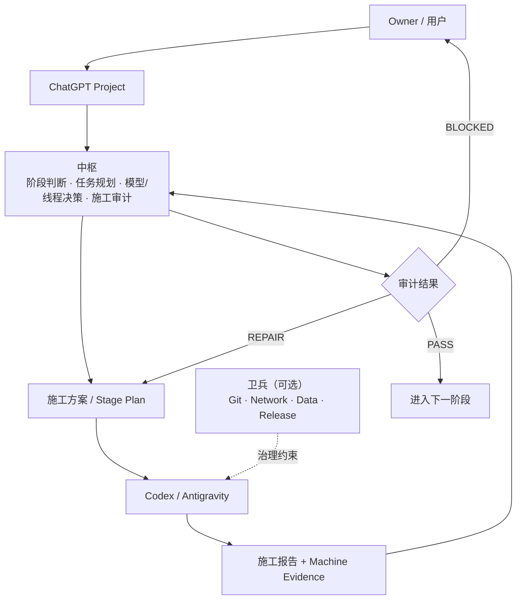
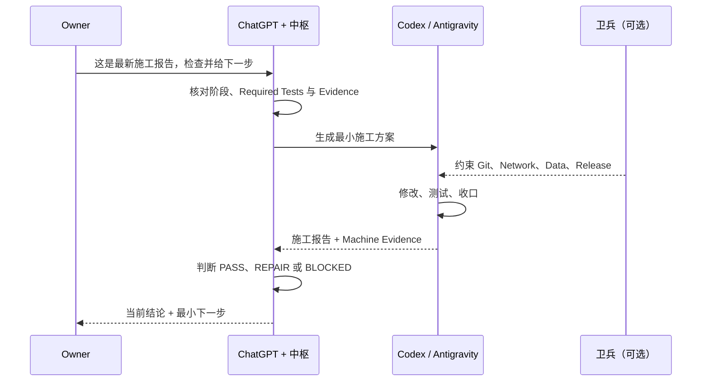

# 中枢 Zhongshu — AI Agent Orchestrator

[](../../releases/latest)
[](../../actions/workflows/repository-consistency.yml)
[](LICENSE)
[](MANIFEST.json)

**让 ChatGPT 更可靠地统筹 Codex / AI Agent 的长期软件开发。**

中枢解决的不是“让 AI 会写代码”，而是长周期 AI 开发中的**上下文连续性、阶段统筹、施工审计、模型与线程决策、风险边界，以及最小下一步**。

<p align="center">
  
</p>

**[5 分钟开始](#5-分钟开始)** · **[Latest Release](../../releases/latest)** · **[完整部署说明](README_部署与使用.md)**

## 为什么需要中枢

长期 AI 辅助开发的难点，往往不在“生成一段代码”，而在于跨阶段持续地知道什么已完成、什么有证据、下一步该做什么，以及什么操作必须先停下来确认。

| 直接使用 ChatGPT / Agent | 加入中枢 |
| --- | --- |
| 新线程时反复解释项目 | 通过最小充分交接延续权威上下文 |
| Agent 自报“完成” | 以施工报告与机器证据审计完成度 |
| 每轮重新规划整个项目 | 只生成当前最值得推进的最小下一步 |
| 小问题频繁等待 Owner | 边界内低风险问题连续闭环 |
| 长线程不断累积噪声 | 在稳定节点压缩并判断是否换线程 |
| 模型选择靠经验 | 选择最低充分模型与推理强度 |
| 治理容易越堆越多 | 坚持最低充分治理 |
| Git、网络、数据、发布边界模糊 | 依据真实副作用明确 Owner Gate |

## 中枢如何工作

中枢是项目级的编排层：它判断阶段、规划工作、审计施工结果，并将真实风险边界交给可选的卫兵治理层。



## 一次任务如何流转

架构图回答“谁与谁协作”；下面这次交互回答“实际使用时发生什么”。



## 一个 30 秒实际案例

下面是一个**示例**，不代表任何真实用户项目或结果。

你把 Codex 的施工报告发给中枢：

> “这是 M1 的最新施工报告，请检查施工质量并给我下一步。”

中枢不会直接回答“继续 M2”。它会先：

1. 检查报告中的 required tests；
2. 核对工作区状态与机器证据；
3. 判断当前阶段是否真的形成 Closure；
4. 得出 PASS、REPAIR 或 BLOCKED；
5. 仅在 PASS 后生成 M2 的最小施工方案；
6. 判断是否需要更换对话线程、Codex 线程、模型或治理强度。

示例输出：

```text
M1: PASS

下一步：
进入 M2，但不扩展治理体系。

推荐：
Codex / 中等推理 / 单 Agent

施工范围：
完成当前 M2 的最小可验证目标。

对话线程：继续 — 项目统筹上下文仍有效。
Codex 线程：更换 — M1 已形成稳定里程碑，保留权威结论并丢弃调试历史。
```

## 核心能力

| 能力 | 中枢负责什么 |
| --- | --- |
| Stage Management | 判断当前阶段与阶段切换是否成立 |
| Task Planning | 生成最小充分施工方案 |
| Report Review | 审计 Agent 的施工结果与边界遵守情况 |
| Evidence | 区分 Agent 声明与可验证的机器证据 |
| Model Routing | 选择最低充分模型与推理强度 |
| Context Handoff | 在长线程稳定节点压缩与换线程 |
| Workspace Awareness | 判断工作区是否适合继续施工 |
| Execution Gating | 仅对真实高风险动作触发 Owner Gate |
| Governance Integration | 与卫兵连接，但不复制卫兵能力 |

## 适合谁 / 不适合谁

**适合：**

- 使用 ChatGPT + Codex / Agent 推进数天、数周或更长的软件项目；
- 项目有多个阶段、多个施工任务或多个上下文；
- 需要审计 Agent 是否真的完成了任务；
- 经常把施工报告转化为下一轮任务；
- 希望减少重复解释与不必要的人工授权；
- 需要清楚区分 Git、Network、Data、Release 的风险边界。

**可能不需要：**

- 一次对话即可完成的小脚本；
- 单文件、低风险的简单修改；
- 不需要长期上下文的任务；
- 不使用 Coding Agent 的纯问答场景。

## 5 分钟开始

无需 Git、Python、GitHub CLI，也不需要先安装卫兵。你只需要一个 ChatGPT Project；如需本地代码施工，再接入 Codex / Antigravity。

1. 从 [Latest Release](../../releases/latest) 下载 **Latest Runtime Pack**（ZIP）。
2. 解压 ZIP 文件。
3. 打开解压目录中的 `project-upload/`。
4. 将 `project-upload/` 的全部文件上传到 ChatGPT Project 的 Project Sources。
5. 打开 `PROJECT_INSTRUCTIONS.txt`，将全文复制到 ChatGPT Project 的 Project Instructions。
6. 发送以下安装自检提示词。
7. 收到 `ZHONGSHU_RUNTIME_READY` 即部署完成。

```text
检查中枢是否部署完整。

请只检查当前 Project 已提供的中枢 Runtime：

1. 告诉我检测到的 Runtime 版本；
2. 检查需要的 Project Source 文件是否完整；
3. 检查 Project Instructions 是否已生效；
4. 如果缺少文件，直接告诉我缺哪个；
5. 如果完整，只回复：

ZHONGSHU_RUNTIME_READY

并告诉我下一步如何启动一个新项目。
```

更详细的分步说明见 [START_HERE.md](START_HERE.md) 和 [完整部署与使用说明](README_部署与使用.md)。

## 部署完成后直接这样用

**启动新项目：**

```text
使用中枢启动这个项目。

项目：
<项目名>

本地工作区：
<路径>

目标：
<一句话目标>
```

**接管已有项目：**

```text
使用中枢接管当前项目。
这是最新施工报告 / 交接文档。
```

**Agent 做完后：**

```text
按中枢审计这份施工报告，并给出最小下一步。
```

**判断长线程：**

```text
按中枢判断是否应该换线程；如果应该，生成最小充分交接。
```

## 中枢与卫兵

| 中枢 | 卫兵 |
| --- | --- |
| 项目级统筹 | 施工现场治理 |
| 决定做什么 | 约束能怎么做 |
| 阶段、任务、模型、线程 | Git、Network、Data、Release |
| 审计结果 | 提供工作区与执行事实 |
| 可独立使用 | 可选增强 |

> 中枢做项目级决策；卫兵做施工现场治理。

## 设计原则

### Minimum Sufficient Governance

治理只做到足够，不为了形式继续加层。

### Evidence over Claims

Agent 说“完成”不等于真的完成；收口需要可核对的证据。

### Smallest Next Step

每次只规划当前最值得推进的一步，而不是重新规划整个项目。

### Finish Local Value, Then Compress

长线程先完成当前局部价值；一旦形成稳定结论，再压缩并评估换线程。

### Execution Form Is Not Risk

是否使用 Agent、CLI 或 PowerShell 不是风险本身；应根据真实副作用决定边界与 Owner Gate。

## Latest Release / Runtime Pack

当前 Runtime 版本记录在 [MANIFEST.json](MANIFEST.json)，版本变化见 [CHANGELOG.md](CHANGELOG.md)。面向使用者的主要下载入口是 [Latest Release](../../releases/latest) 中的 Runtime Pack，而不是 Source code ZIP。

## Documentation

- [5 分钟部署](START_HERE.md)
- [完整部署与使用](README_部署与使用.md)
- [核心 Runtime](SKILL.md)
- [Release Governance](RELEASE_GOVERNANCE.md)
- [版本变化](CHANGELOG.md)
- [项目文件清单](MANIFEST.json)

## 当前边界

中枢不是：

- Coding Agent；
- IDE；
- 自动代码生成器；
- CI/CD 平台；
- 卫兵的替代品。

当前主要服务于 ChatGPT Project + Codex / Antigravity 的长期软件开发统筹。中枢保持可独立使用；卫兵是可选的现场治理增强。

## License

本项目采用 [MIT License](LICENSE)。
