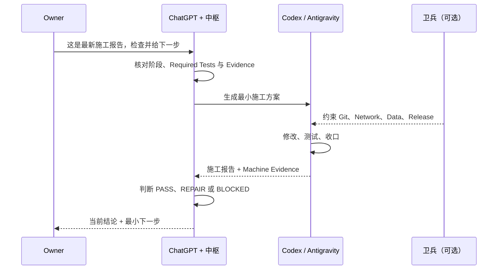

# 中枢 Runtime Deployment Pack V1.6.1

## 1. 这是什么

这是给**网页版 ChatGPT 项目统筹线程**使用的运行时包。

它不是卫兵，也不是项目代码。

定位：

```text
你
↓
网页版 GPT + 中枢
↓
施工方案 / 阶段判断 / 报告审计
↓
本地 Codex / Antigravity
↓
卫兵约束施工
↓
施工报告
↓
回到中枢
```

---

## 2. 部署到一个 ChatGPT Project

建议每个真实软件项目单独建立一个 ChatGPT Project，例如：

```text
风信
领航员
镜鉴
```

不要把多个业务项目全部放入同一个“中枢” Project。

### 步骤 A｜上传运行时文件

把以下文件上传到该 ChatGPT Project 的项目文件 / Sources：

```text
SKILL.md

policies/
├── model-routing.yaml
├── governance-adapter.md
├── debug-escalation.md
├── execution-gating.md
└── workspace-health.md

templates/
├── stage-plan.md
├── stage-report.md
└── thread-handoff.md
```

`PROJECT_INSTRUCTIONS.txt` 不必作为普通项目资料使用，它的正文应该复制到 Project Instructions。

---

### 步骤 B｜设置 Project Instructions

打开：

```text
ChatGPT Project
→ Project settings
→ Project instructions
```

复制 `PROJECT_INSTRUCTIONS.txt` 的全部内容。

这部分是“启动器”。

完整方法仍以 `SKILL.md` 和 policies 为准。

---

## 3. 第一次使用

### 新项目

发送：

```text
使用中枢启动这个项目。

项目：
<项目名>

本地工作区：
<绝对路径>

目标：
<一句话目标>
```

中枢应进入 `NEW_PROJECT`，完成：

```text
最低需求对齐
→ 判断 MVP / 非目标 / 数据风险
→ 检查是否已有治理
→ 判断是否需要卫兵
→ 规划当前第一阶段
→ 推荐最低可行执行资源
→ 生成最小施工方案
```

---

### 已有项目

发送：

```text
使用中枢接管当前项目。
这是当前最新施工报告 / 交接文档。
```

然后上传最新报告或权威文件。

中枢应优先使用现有治理，不重新建制。

---

## 4. 日常最常用的三句话

### Codex 做完以后

```text
按中枢审计这份施工报告。
```

### 要下一轮施工

```text
生成下一步最小施工方案。
```

### 当前线程太长

```text
按中枢判断是否应该换线程；如果应该，生成最小充分交接。
```

---

## 5. 施工文件如何流转

推荐本地项目统一：

```text
<PROJECT_ROOT>/
├── .agent-plans/
└── .agent-reports/
```

典型闭环：

```text
网页版 GPT / 中枢
↓
生成 .agent-plans/<任务>.md
↓
你把方案交给 Codex / Antigravity
↓
卫兵约束施工
↓
生成 .agent-reports/<报告>.md
↓
你把报告同步回网页版 GPT
↓
中枢审计
↓
PASS / REPAIR / PARTIAL / BLOCKED
↓
决定最小下一步
```

---

## 6. 与卫兵的关系

中枢：

- 决定该不该做；
- 决定下一步做什么；
- 决定 Codex / Antigravity；
- 决定模型强度；
- 决定单 / 多 Agent；
- 决定是否进入下一阶段；
- 判断工作区是否适合继续推进。

卫兵：

- 约束 Agent 能改什么；
- 约束 Git / Network / Data / Release；
- 提供 Workspace Baseline；
- 提供变更、测试和工作区事实；
- 阻止危险操作；
- 提供多 Agent 写入隔离。

核心原则：

> 中枢做项目级决策；卫兵做现场治理。

---

## 7. 当前卫兵版本不支持全部接口怎么办

不阻塞中枢。

接口能力允许：

```text
AVAILABLE
PARTIAL
UNKNOWN
```

如果卫兵没有：

```text
workspace_health
pre_existing_changes
task_created_changes
hygiene_recommendations
```

中枢不得自己复制一套卫兵。

只需：

```text
缺少但不影响当前低风险决策
→ 继续

缺少且影响重大阶段判断
→ 生成 Codex 只读 Reality Check
```

---

## 8. 网页版 GPT 看不到本机仓库时

必须遵守：

> 无真实机器证据，不声称已检查当前机器。

例如需要确认：

```text
git status
当前测试状态
真实代码是否已实现某功能
卫兵当前版本是否存在某接口
```

而网页版 GPT 无法访问本地仓库时，应生成只读 Codex 任务获取机器事实。

不能根据旧报告或历史记忆直接声称“已经确认”。

---

## 9. 推荐线程结构

项目较小时：

```text
01｜项目路线与统筹
02｜当前施工阶段
```

中大型项目：

```text
01｜项目路线 / Owner 决策
02｜施工统筹
├── M0｜阶段线程
├── M1｜阶段线程
└── M2｜阶段线程
```

不是每个小补丁都建立新线程。

只有：
- 阶段明显变化；
- 上下文已经过长；
- 技术领域明显切换；
- 稳定里程碑已经收口；

才建议换线程。

---

## 10. 当前版本边界

V1.6.1 Runtime 不做：

- 自动修改本地代码；
- 自动 Git；
- 自动部署卫兵；
- 自动创建线程；
- 项目状态数据库；
- Workspace Scanner；
- ChangeTracker；
- Stage Manager；
- Multi-Agent Orchestrator。

目标只有一个：

> 让网页版 GPT 稳定复用一套低成本、高边际收益的开发统筹方法。

---

## 11. 推荐试运行

不要第一天就部署到全部项目。

建议顺序：

```text
1. 先选择一个仍在开发的项目
2. 部署 Runtime Pack
3. 连续跑 2–3 个“报告审计 → 下一方案”闭环
4. 记录：
   - 是否减少重复说明
   - 是否模型选择更经济
   - 是否减少过度治理
   - 是否正确处理脏工作区
   - 是否生成了不必要的线程/文档
5. 再决定是否推广
```

若运行中发现中枢规则与项目治理冲突，以项目内最新且更严格治理规则为准。


---

## V1.1 新增

复杂调试时，中枢可以从普通施工换挡到“受约束自主调试”。

所有重要施工回复必须明确区分：

```text
对话线程：继续 / 更换
Codex 线程：继续 / 更换
```

如果 Codex 已积累大量失败路径、失效假设和旧补丁，应优先新开 Codex 调试线程，并使用压缩交接。


---

## V1.2 新增：Codex 模型、推理等级与线程联合路由

本规则**只适用于 Codex**，不调整网页版对话线程的模型使用规则。

核心判断：

```text
任务变复杂
↓
Codex 上下文是否健康且高价值？
↓
当前模型能力是否足够？
```

如果：

```text
模型够 + 上下文高价值
→ 原 Codex 线程
→ 原模型
→ 优先提高推理等级
```

如果：

```text
模型能力不足
→ 压缩交接
→ 新 Codex 线程
→ 升级模型
```

如果：

```text
上下文污染
→ 新 Codex 线程
→ 模型重新按任务选择
```

只有在线程非常短、尚未实质施工时，才允许原 Codex 线程直接更换模型。


---

## S2.2｜Codex 长线程上下文成本与最佳换线程点（原计划作为 V1.3，最终随 V1.4 正式发布）
只增强现有 Context Saturation / Codex Thread Handoff，不新增 Token 监控器、Context Manager、自动终止线程或 Token 硬阈值。

核心原则：Cached Context Is Not Free Context；Token Is a Signal, Not a Threshold；Finish Local Value, Then Compress。

当前局部任务价值高且历史噪声高时，不在修复中途硬切；先完成 PASS / OFFLINE_PASS，再立即压缩交接并新开 Codex 线程，模型可以保持不变。


---

## V1.4 新增：Host 执行门与 Owner Gate 最小化

核心原则：

```text
Execution Form Is Not Risk
Minimum Owner Gate
Machine-Readable Handoff After Owner Action
```

不要因为命令是 PowerShell / Shell 就默认要求 Owner 手工执行。

典型流程：

```text
Codex 完成全部离线工作
→ 只剩一次真实外部验证
→ Owner 执行唯一 hard-boundary command
→ Owner 回复“已执行”
→ Codex 自动读取 result / audit
→ 继续判断
```

如果已有卫兵 / TaskContract 明确授权，则优先复用，不新建 Execution Manager。

---

## 12. 详细能力矩阵

| 能力 | 中枢负责什么 |
| --- | --- |
| Stage Management | 判断当前阶段与阶段切换是否成立 |
| Task Planning | 生成最小充分施工方案 |
| Report Review | 审计 Agent 的施工结果与边界遵守情况 |
| Evidence | 区分 Agent 声明与可验证的机器证据 |
| Model Routing | 选择最低充分模型与推理强度 |
| Context Handoff | 在长线程稳定节点压缩与换线程 |
| Workspace Awareness | 判断工作区是否适合继续施工 |
| Execution Gating | 仅对真实高风险动作触发 Owner Gate |
| Governance Integration | 与卫兵连接，但不复制卫兵能力 |

---

## 13. 设计原则

### Minimum Sufficient Governance
治理只做到足够，不为了形式继续加层。

### Evidence over Claims
Agent 说“完成”不等于真的完成；收口需要可核对的证据。

### Smallest Next Step
每次只规划当前最值得推进的一步，而不是重新规划整个项目。

### Finish Local Value, Then Compress
长线程先完成当前局部价值；一旦形成稳定结论，再压缩并评估换线程。

### Execution Form Is Not Risk
是否使用 Agent、CLI 或 PowerShell 不是风险本身；应根据真实副作用决定边界与 Owner Gate。

---

## 14. 任务交互时序图



---

## V1.6 新增：网页对话输出规则

中枢默认不再先写长篇分析。重要施工回复顶部直接给：对话线程、Codex 线程、推荐工具、推荐模型、模型胜任度、推荐推理等级、施工模式、Owner 是否需要操作。

然后只从用户角度说明：现在做到哪、真正的问题、对你的影响、下一步。需要施工时直接生成 Markdown 方案，并给一段可复制提示词。详细工程分析留在施工方案/审计文档里。

---

## V1.6.1 修正：取消常态“模型胜任度”

正常施工回复不再显示：

``text
模型胜任度：足够 / 勉强 / 不足
``

中枢只根据真实施工质量判断是否需要提醒模型问题。

典型触发：

``text
重复失败
频繁相似错误
跨模块关系持续遗漏
根因反复推翻
复杂约束无法稳定保持
``

触发后先排查 reasoning、上下文、规格、环境、测试数据等原因；只有中高置信时才提示模型能力不足。
